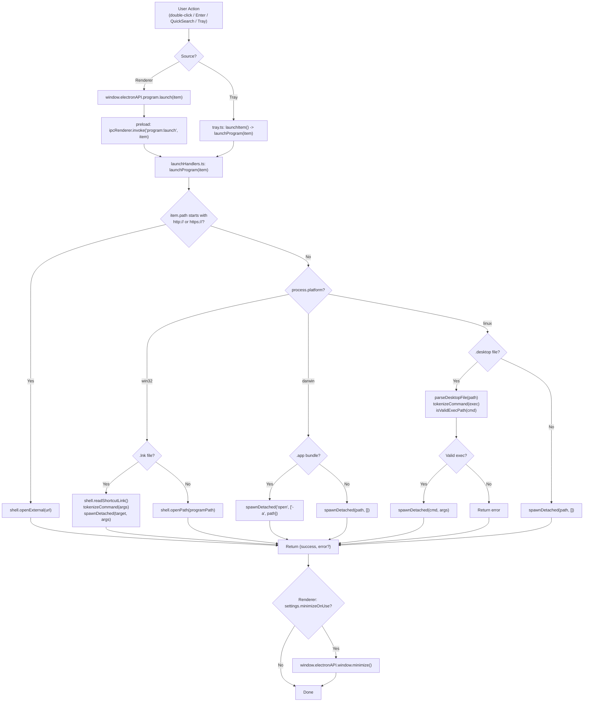
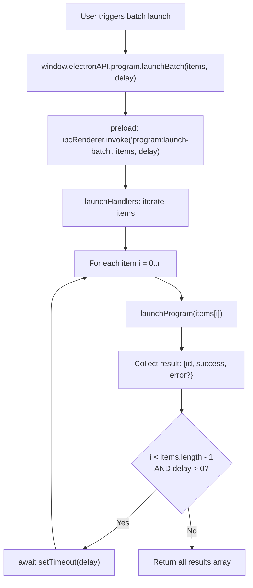
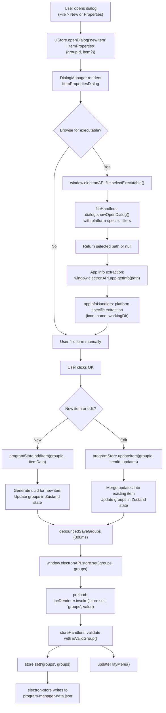
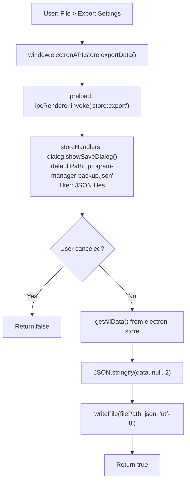
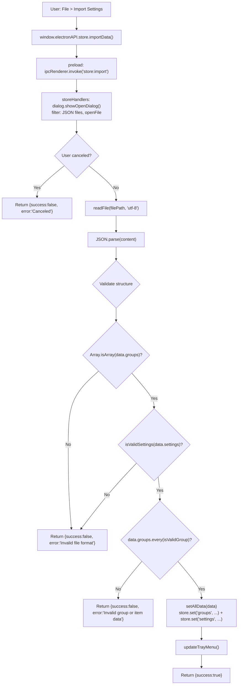
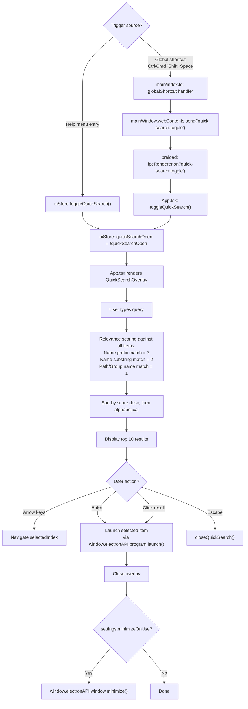
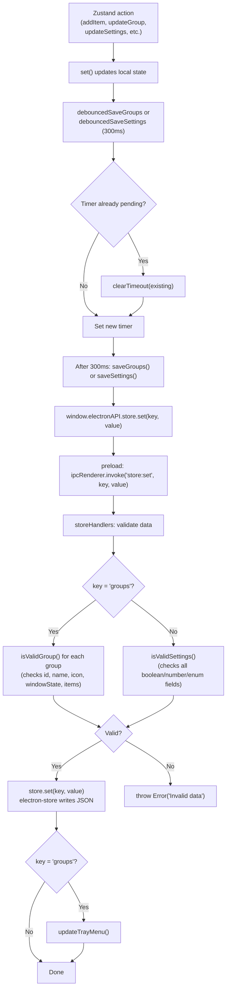

# Data Flow Diagrams

Request/response flows for key operations, traced through actual code paths.

## Program Launch Flow

When a user launches a program (double-click, Enter key, quick search, or tray menu):

## Batch Launch Flow

When launching a group of items with delay:

## Add / Edit Item Flow

When creating or editing a program item via the ItemPropertiesDialog:

## Import / Export Flow

### Export

### Import

## Quick Search Flow

## Store Persistence Flow (Debounced)

---

## Research Log

| Source File | What Was Verified |
|---|---|
| `src/main/ipc/launchHandlers.ts` | Full platform dispatch logic for program launch (win32 .lnk handling, darwin .app bundles, linux .desktop parsing), tokenizeCommand, isValidExecPath, spawnDetached, batch launch with delay, URL handling via shell.openExternal, system:open-external handler |
| `src/main/ipc/storeHandlers.ts` | store:get/set/get-all/export/import handlers, validation functions (isValidItem, isValidGroup, isValidSettings), export uses dialog.showSaveDialog + writeFile, import uses showOpenDialog + readFile + parse + 3-stage validation + setAllData, tray menu updates on group changes |
| `src/main/ipc/fileHandlers.ts` | File dialog handlers with platform-specific filters for executables and icons |
| `src/main/ipc/appInfoHandlers.ts` | Per-platform app info extraction: macOS (.app icon), Windows (.lnk resolution, .exe icon), Linux (.desktop parsing with Exec/Name/Icon fields) |
| `src/main/store.ts` | electron-store wrapper: file name `program-manager-data`, defaults, getAllData/setAllData functions |
| `src/main/index.ts` | Global shortcut registration (Ctrl/Cmd+Shift+Space) -> webContents.send('quick-search:toggle') |
| `src/preload/index.ts` | contextBridge: 6 API namespaces (window, file, program, store, system, app) + event listener with whitelist |
| `src/renderer/src/store/programStore.ts` | All Zustand actions with debounced saves (300ms), uuid generation for new items/groups, IPC calls to store:set |
| `src/renderer/src/store/uiStore.ts` | Quick search state management (toggleQuickSearch, openQuickSearch, closeQuickSearch) |
| `src/renderer/src/App.tsx` | Quick search IPC listener, launch helper with minimizeOnUse, welcome dialog on first run |
| `src/renderer/src/components/QuickSearch/QuickSearchOverlay.tsx` | Search scoring algorithm (prefix=3, substring=2, path/group=1), max 10 results, keyboard navigation, launch on Enter |
