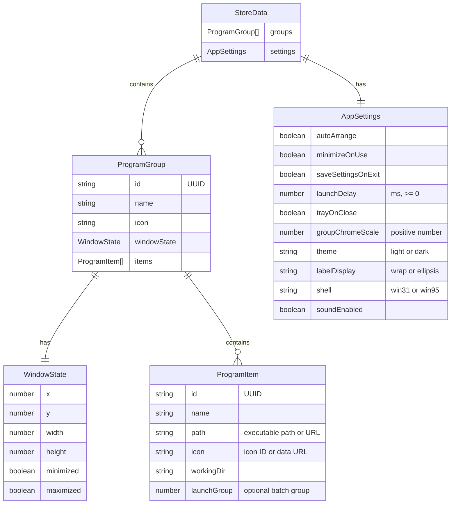
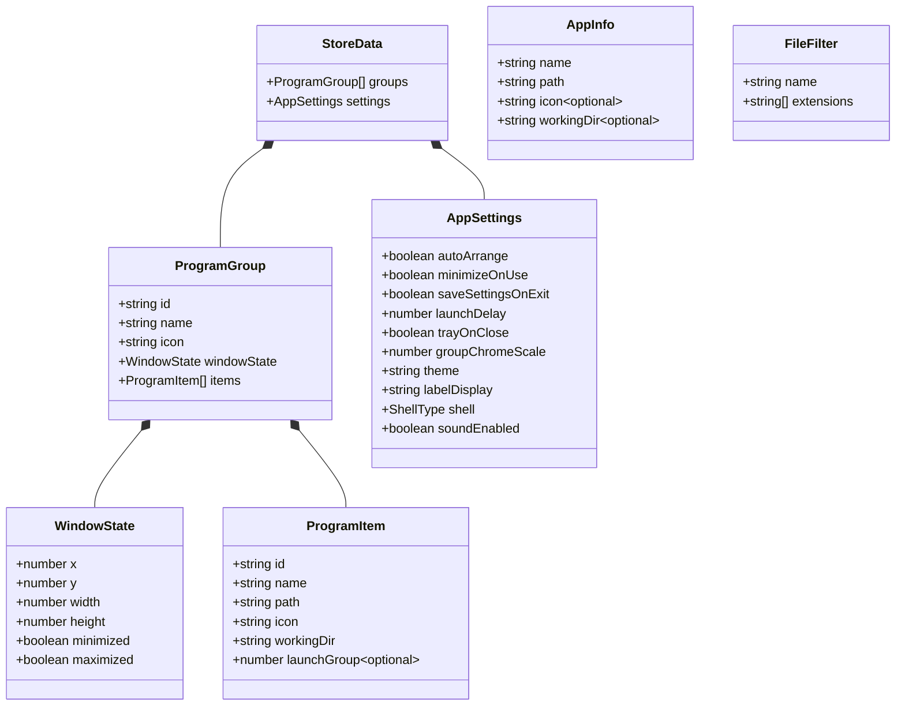
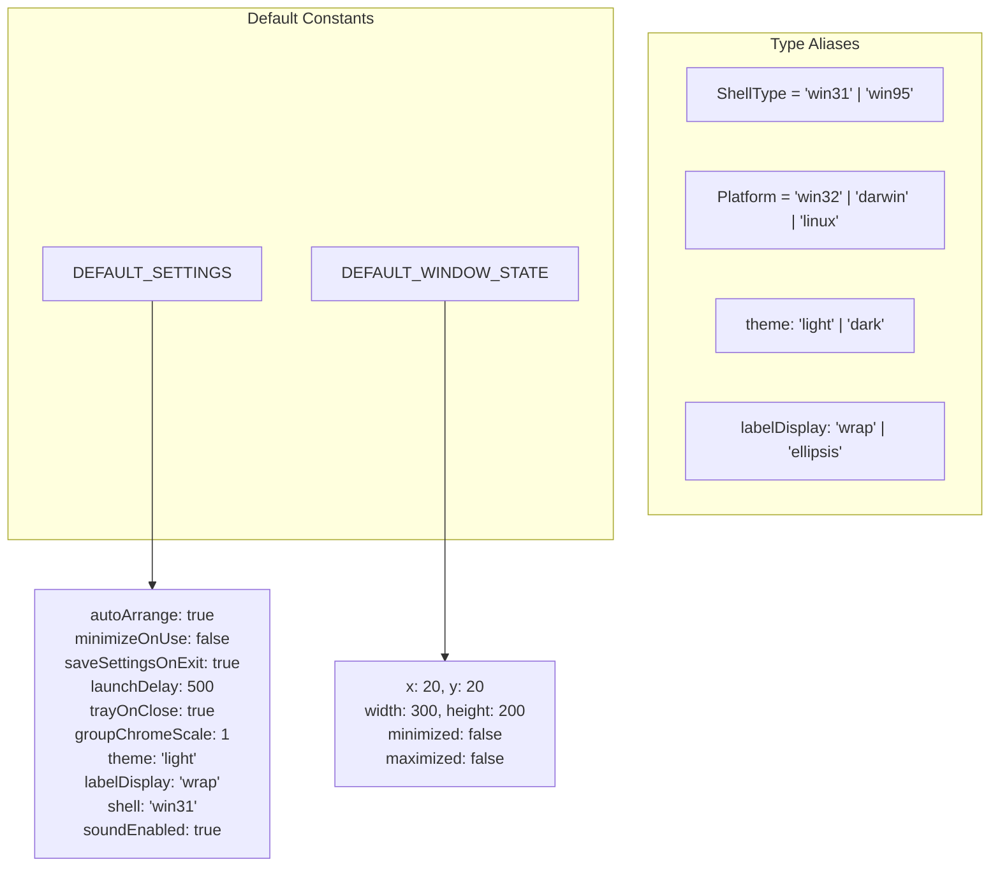
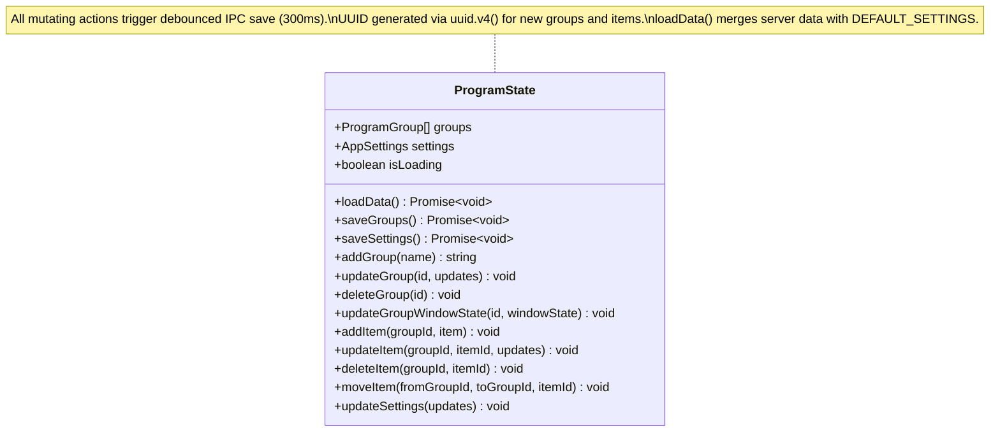
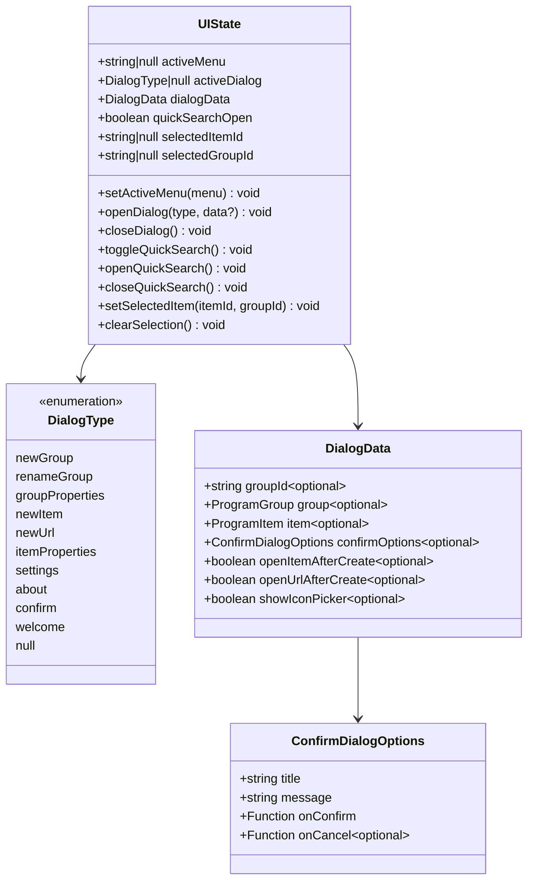
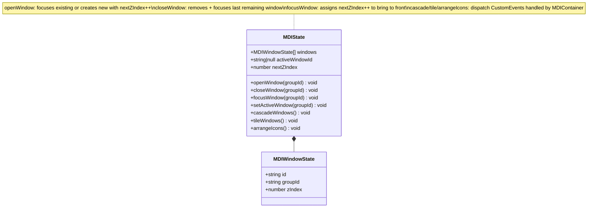
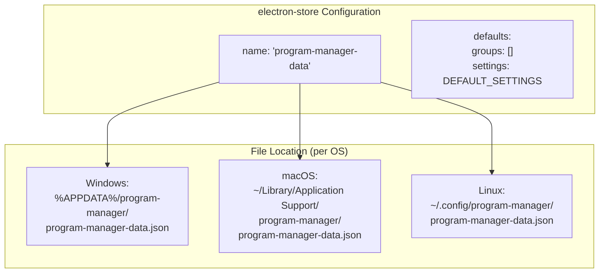
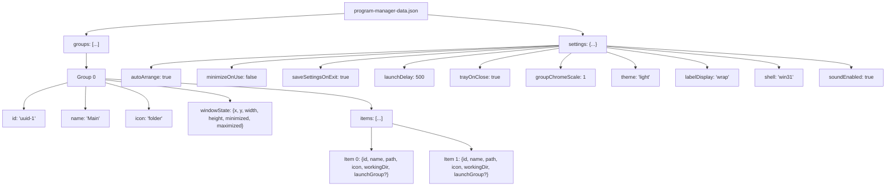
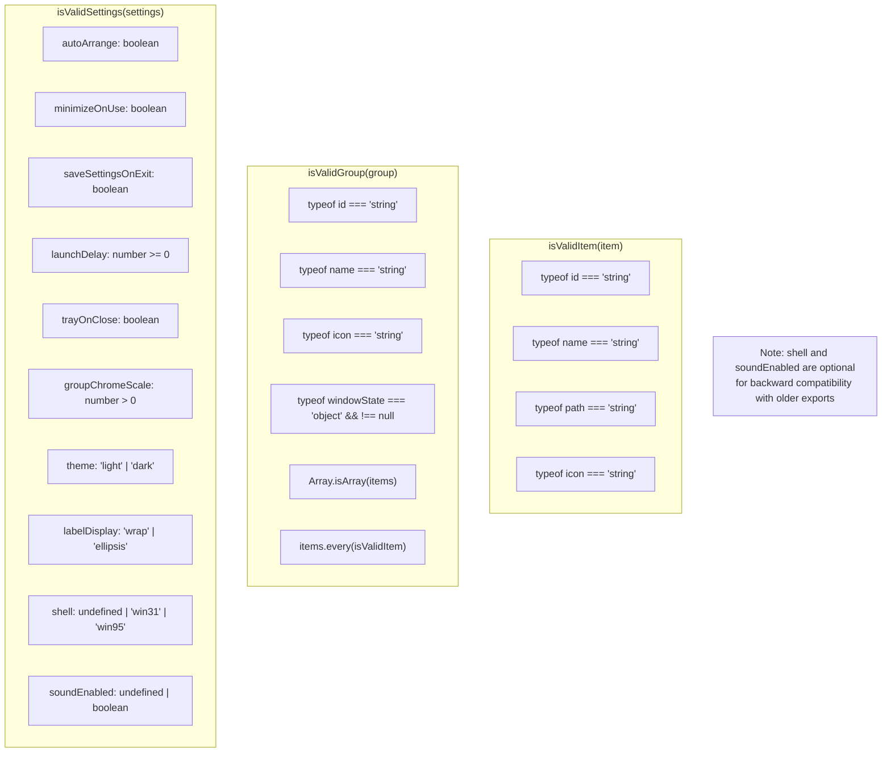

# Data Model Diagrams

Data types from `src/shared/types/index.ts`, Zustand store state shapes, and persistence format.

## Core Data Types (Entity Relationship)

## All Shared Type Definitions

## Type Aliases and Constants

## Zustand Store: programStore

## Zustand Store: uiStore

## Zustand Store: mdiStore

## Persistence Format

The data is stored as a JSON file by electron-store at the OS-specific config path.

Example JSON structure:

## Validation Rules

Data validation functions in `storeHandlers.ts` enforce these constraints on import and IPC writes:

---

## Research Log

| Source File | What Was Verified |
|---|---|
| `src/shared/types/index.ts` | All interfaces: ProgramItem (6 fields, launchGroup optional), WindowState (6 fields), ProgramGroup (5 fields), AppSettings (10 fields), StoreData, AppInfo, FileFilter. Type aliases: ShellType, Platform. Constants: DEFAULT_SETTINGS, DEFAULT_WINDOW_STATE |
| `src/main/store.ts` | electron-store config: name='program-manager-data', StoreSchema with groups+settings, defaults, getter/setter functions |
| `src/renderer/src/store/programStore.ts` | ProgramState interface: groups, settings, isLoading + 12 actions. Debounced saves (300ms timers). UUID via uuid.v4(). loadData merges with DEFAULT_SETTINGS. updateGroupWindowState conditionally saves based on saveSettingsOnExit |
| `src/renderer/src/store/uiStore.ts` | UIState interface: 10 DialogType values, DialogData shape with 7 optional fields, ConfirmDialogOptions, menu/selection/quickSearch state |
| `src/renderer/src/store/mdiStore.ts` | MDIState + MDIWindowState interfaces. z-index management: nextZIndex increments on open/focus. Window arrangement via CustomEvent dispatch |
| `src/main/ipc/storeHandlers.ts` | Validation functions: isValidItem (4 string checks), isValidGroup (6 checks including nested items validation), isValidSettings (10 checks with optional shell/soundEnabled for backward compat). VALID_THEMES, VALID_LABEL_DISPLAYS, VALID_SHELLS arrays |
