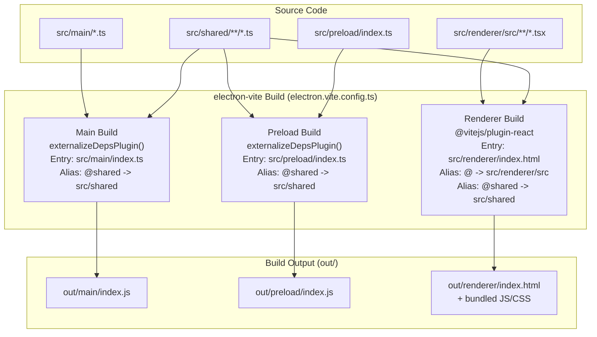
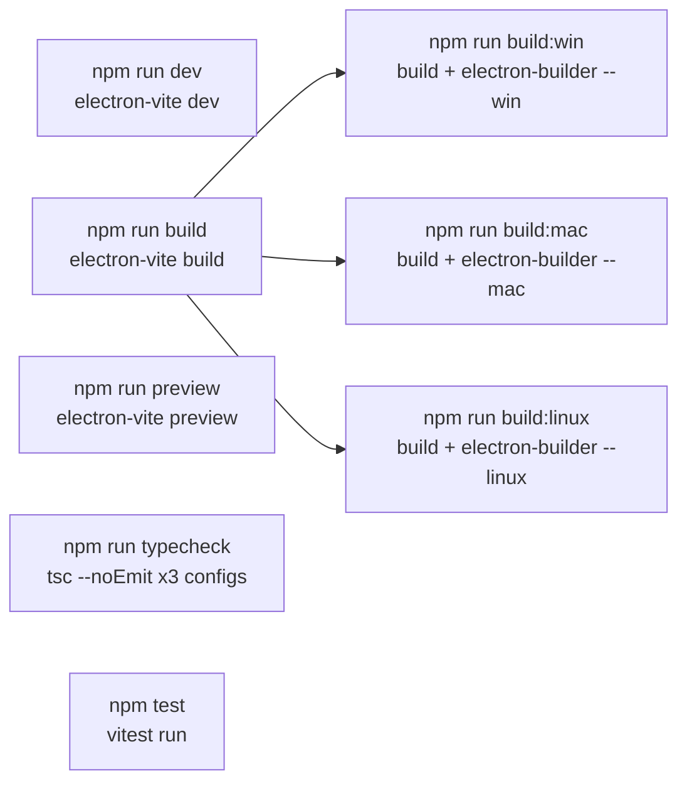
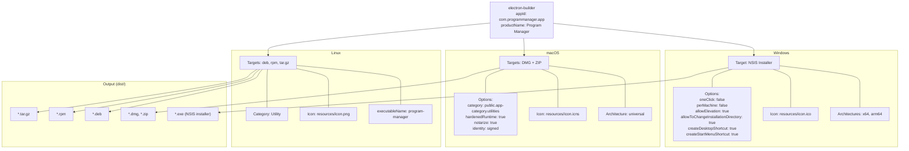
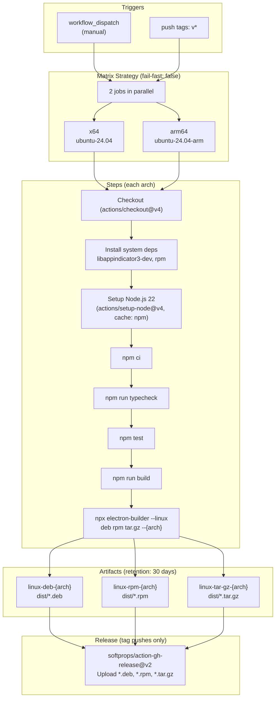
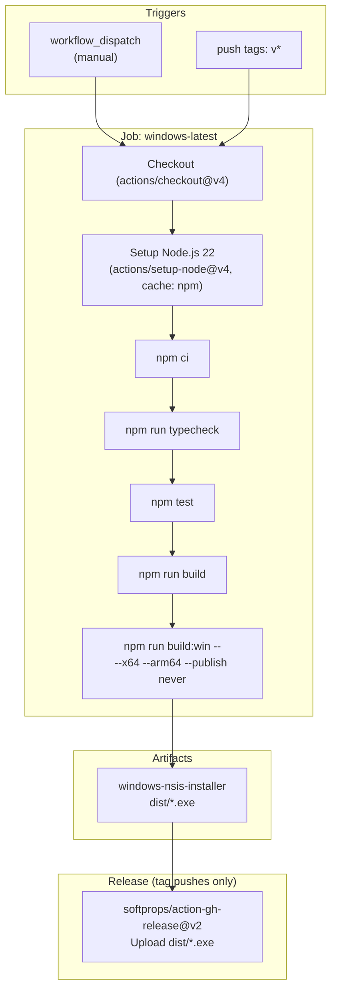
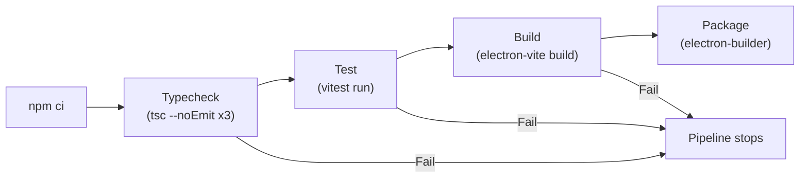
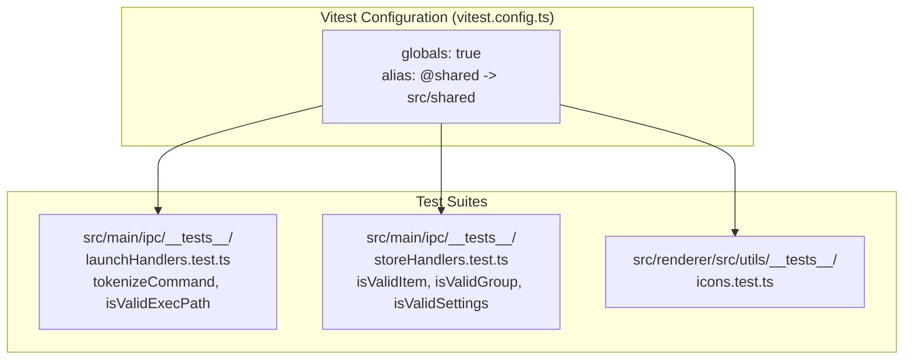

# Deployment Diagrams

Build tooling, CI/CD pipelines, and platform packaging configuration as currently implemented.

## Build Pipeline

## Package Scripts

## Platform Packaging (electron-builder.yml)

## CI/CD Pipeline: Linux Build

## CI/CD Pipeline: Windows Build

## CI Quality Gates

Both CI workflows enforce the same quality gates before packaging:

The typecheck step runs 3 separate TypeScript compiler invocations:
- `tsconfig.node.json` (main + preload + shared)
- `tsconfig.node.json --composite false` (preload standalone)
- `tsconfig.web.json` (renderer + shared)

## Testing Infrastructure

---

## Research Log

| Source File | What Was Verified |
|---|---|
| `electron.vite.config.ts` | 3 build targets (main, preload, renderer), path aliases (@shared, @), plugins (externalizeDepsPlugin, react), entry points |
| `electron-builder.yml` | Full packaging config: appId, productName, per-platform targets/architectures/icons/options, output directory (dist/), extraResources (assets/), macOS signing identity + notarization |
| `.github/workflows/build-linux.yml` | Trigger (workflow_dispatch + v* tags), matrix (x64 ubuntu-24.04 + arm64 ubuntu-24.04-arm), steps (checkout, apt deps, node 22, npm ci, typecheck, test, build, package), artifact uploads (deb/rpm/tar.gz per arch, 30-day retention), release upload on tag push |
| `.github/workflows/build-windows.yml` | Trigger (workflow_dispatch + v* tags), runner (windows-latest), steps (checkout, node 22, npm ci, typecheck, test, build, package x64+arm64), artifact upload (NSIS exe), release upload on tag push |
| `package.json` | All npm scripts (dev, build, preview, build:win/mac/linux, typecheck, test), dependencies (electron v40, react v19, zustand v5, electron-store v8, uuid v11), devDependencies (electron-vite v5, vite v7, vitest v4, typescript v5, electron-builder v26) |
| `vitest.config.ts` | globals:true, @shared alias |
| No macOS CI workflow file exists | [UNVERIFIED] macOS builds are configured in electron-builder.yml but there is no .github/workflows/build-mac.yml workflow. macOS packaging may only be done locally. |
