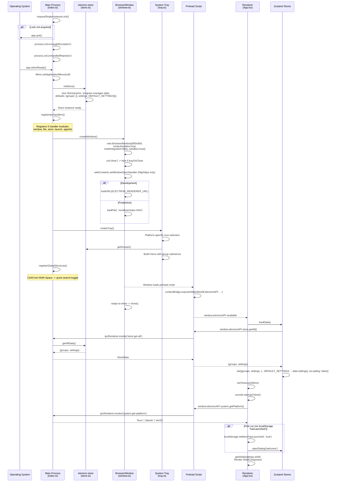
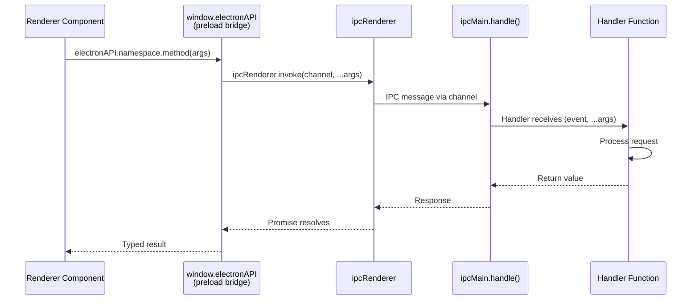
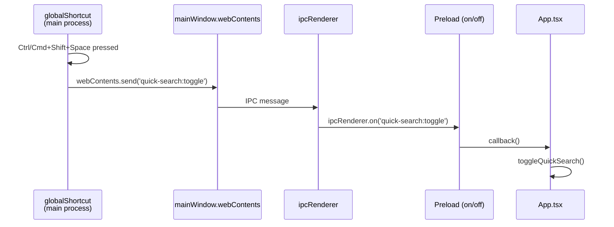
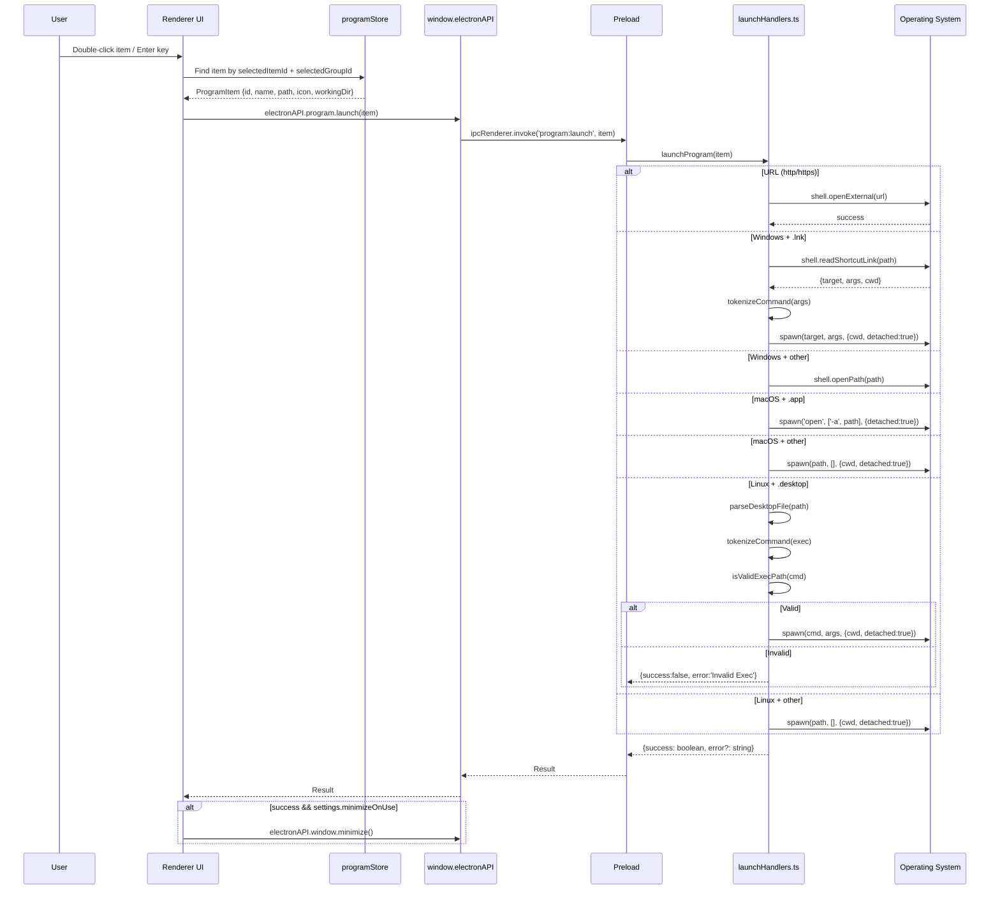
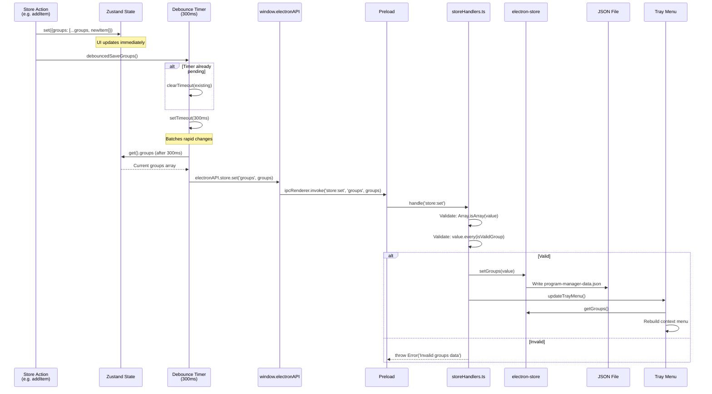
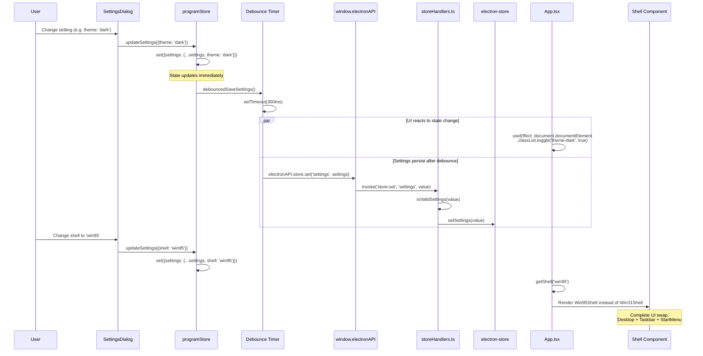
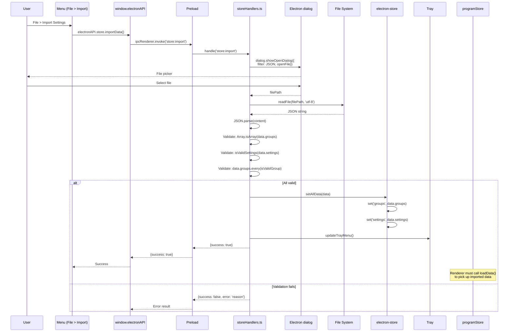
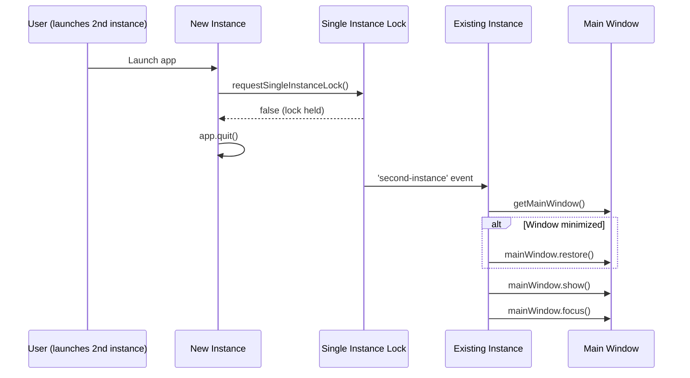

# Sequence Diagrams

Critical interactions traced through actual code paths, showing the exact function calls and IPC channels used.

## App Startup Sequence

## IPC Communication Pattern

All renderer-to-main communication uses the invoke/handle pattern through the preload bridge.

The one exception is the main-to-renderer push for quick search:

## Program Launch Flow (Full Sequence)

## Store Persistence Sequence (Debounced Write)

## Settings Sync Sequence

## Import Data Sequence

## Second Instance Handling

---

## Research Log

| Source File | What Was Verified |
|---|---|
| `src/main/index.ts` | Full startup sequence: requestSingleInstanceLock -> uncaughtException/unhandledRejection handlers -> app.whenReady (setApplicationMenu(null), initStore, registerIpcHandlers, createWindow, createTray, registerGlobalShortcuts) -> activate handler -> window-all-closed -> before-quit -> will-quit -> second-instance handler |
| `src/main/store.ts` | electron-store initialization: name='program-manager-data', defaults, getAllData returns {groups, settings} |
| `src/main/window.ts` | BrowserWindow creation: 800x600, security flags, close handler (trayOnClose check), dev/prod URL loading, ready-to-show -> show(), window open handler (http/https only) |
| `src/main/tray.ts` | Tray creation: platform icon selection, buildTrayMenu from getGroups(), double-click handler, updateTrayMenu called from storeHandlers |
| `src/main/ipc/index.ts` | 5 handler modules registered in order |
| `src/main/ipc/windowHandlers.ts` | invoke handlers for window:minimize/maximize/close/quit/is-maximized + system:get-platform + system:get-version |
| `src/main/ipc/launchHandlers.ts` | launchProgram: URL check -> platform switch (win32 .lnk/other, darwin .app/other, linux .desktop/other), tokenizeCommand, isValidExecPath, parseDesktopFile, spawnDetached({detached:true, stdio:'ignore'}), batch launch with delay loop, system:open-external with URL protocol validation |
| `src/main/ipc/storeHandlers.ts` | store:get (switch on key), store:set (validate then persist + updateTrayMenu for groups), store:get-all (getAllData), store:export (showSaveDialog + writeFile), store:import (showOpenDialog + readFile + parse + 3-stage validation + setAllData + updateTrayMenu) |
| `src/preload/index.ts` | contextBridge with 6 namespaces, invoke pattern for all channels, on/off with whitelist [quick-search:toggle], ipcListenerMap for cleanup |
| `src/renderer/src/App.tsx` | loadData on mount -> startupChime after 300ms, getPlatform, first-run localStorage check, quick-search:toggle IPC listener, shared keyboard shortcuts, shell resolution via getShell, theme CSS class toggle |
| `src/renderer/src/store/programStore.ts` | All actions: debounced save functions (300ms clearTimeout+setTimeout pattern), loadData merges with DEFAULT_SETTINGS, addGroup calculates window offset, addItem generates UUID, all mutations call debouncedSaveGroups/debouncedSaveSettings |
| `src/renderer/src/store/uiStore.ts` | Quick search toggle, dialog open/close, menu state, selection state |
| `src/renderer/src/store/mdiStore.ts` | Window z-index management with nextZIndex++, CustomEvent dispatch for cascade/tile/arrange |
