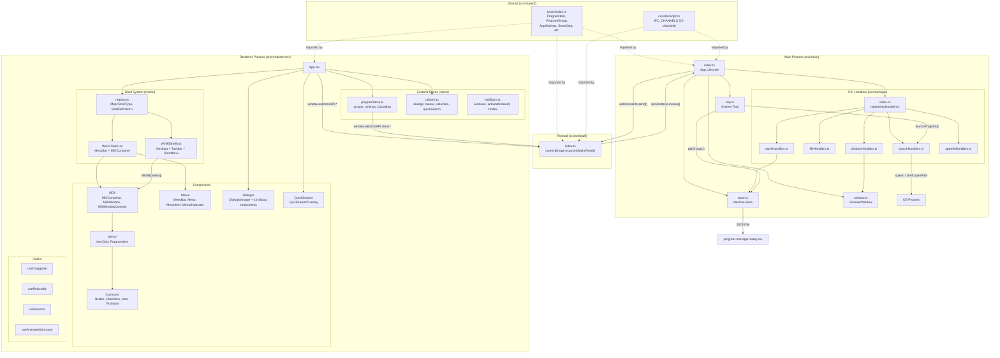
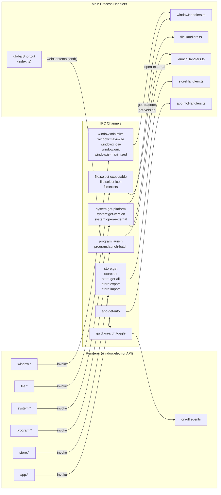
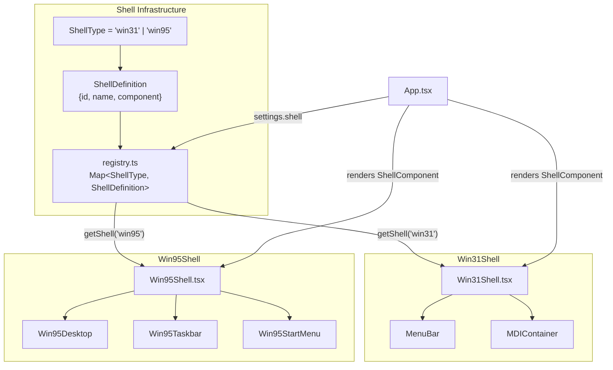
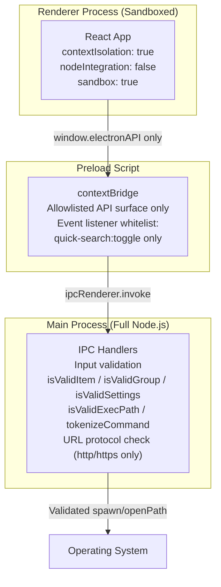

# System Architecture

High-level component diagram showing the Electron process architecture, store layer, shell system, and IPC communication channels.

## Process Architecture

## IPC Channel Map

All IPC communication flows through the preload bridge. The renderer never has direct access to Node.js APIs.

Note: `system:get-platform` and `system:get-version` are registered in `windowHandlers.ts`, while `system:open-external` is registered in `launchHandlers.ts`.

## Shell System

The pluggable shell system allows switching between UI themes at runtime.

## Security Boundaries

---

## Research Log

| Source File | What Was Verified |
|---|---|
| `src/main/index.ts` | App lifecycle: single instance lock, startup sequence (initStore -> registerIpcHandlers -> createWindow -> createTray -> registerGlobalShortcuts), error handlers, global shortcut registration |
| `src/main/store.ts` | electron-store initialization with StoreSchema, file name `program-manager-data`, default values, getter/setter functions |
| `src/main/window.ts` | BrowserWindow config (800x600, contextIsolation:true, nodeIntegration:false, sandbox:true), tray-on-close behavior, dev vs production loading |
| `src/main/tray.ts` | System tray with dynamic group/item menu, platform-specific icons, direct program launch capability |
| `src/main/ipc/index.ts` | 5 handler registration modules |
| `src/main/ipc/windowHandlers.ts` | Handles window:* channels + system:get-platform + system:get-version |
| `src/main/ipc/fileHandlers.ts` | Handles file:* channels with platform-specific filters |
| `src/main/ipc/storeHandlers.ts` | Handles store:* channels with validation functions |
| `src/main/ipc/launchHandlers.ts` | Handles program:* channels + system:open-external, platform dispatch logic |
| `src/main/ipc/appInfoHandlers.ts` | Handles app:get-info with per-platform extraction |
| `src/preload/index.ts` | contextBridge exposes electronAPI with 6 namespaces + on/off listeners (whitelist: quick-search:toggle) |
| `src/shared/constants/ipc.ts` | 17 IPC channel constants in 7 groups |
| `src/shared/types/index.ts` | All shared interfaces and type definitions |
| `src/renderer/src/App.tsx` | Root component: shell resolution, theme toggling, shared shortcuts, welcome dialog |
| `src/renderer/src/shells/registry.ts` | Shell Map with registerShell/getShell, two built-in shells |
| `src/renderer/src/shells/types.ts` | ShellProps, ShellDefinition interfaces |
| `src/renderer/src/shells/Win31Shell.tsx` | MenuBar + MDIContainer composition, Win31-specific keyboard shortcuts |
| `src/renderer/src/shells/win95/Win95Shell.tsx` | Desktop + Taskbar + StartMenu composition, start menu toggle |
| `src/renderer/src/store/programStore.ts` | Zustand store: groups, settings, isLoading + all CRUD actions with debounced saves |
| `src/renderer/src/store/uiStore.ts` | Zustand store: dialogs (10 types), menus, selection, quick search |
| `src/renderer/src/store/mdiStore.ts` | Zustand store: MDI windows with z-index management, arrangement via CustomEvents |
| `src/renderer/src/components/Dialogs/DialogManager.tsx` | Switch-based dialog rendering for 10 dialog types |
| `electron.vite.config.ts` | 3-target build: main, preload, renderer with path aliases |
