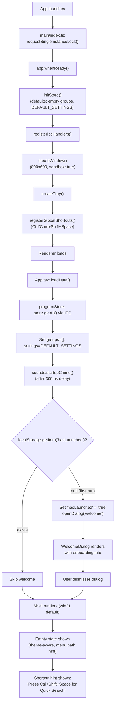
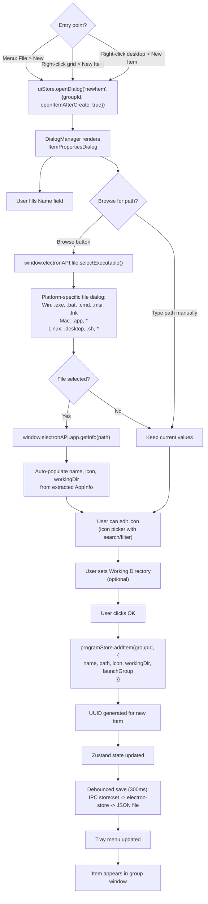
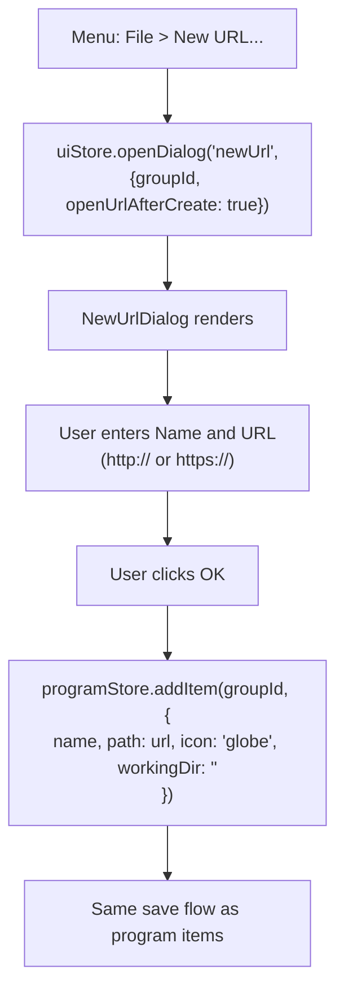
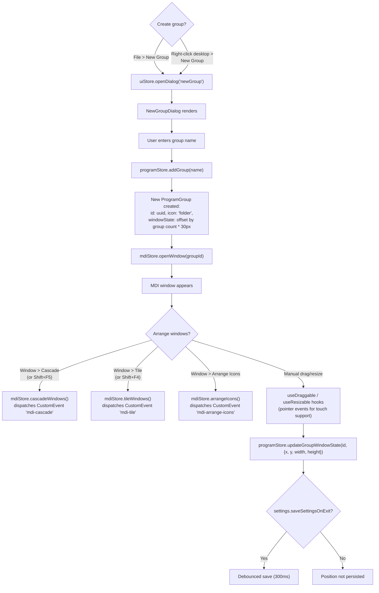
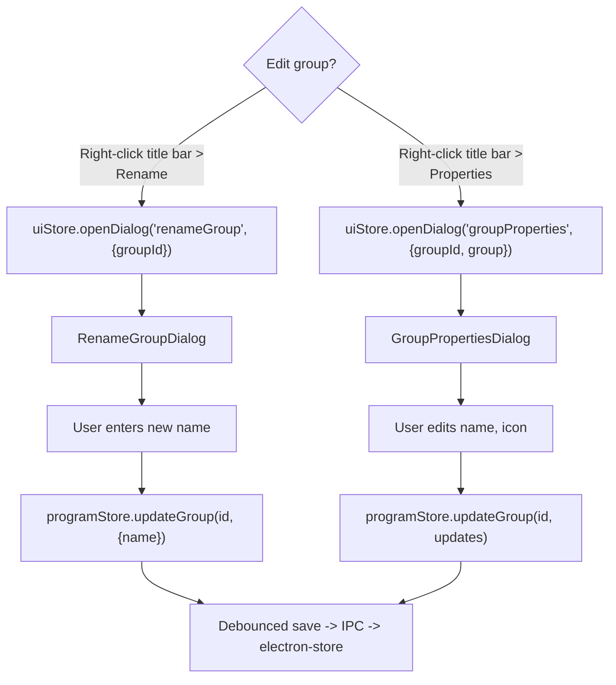
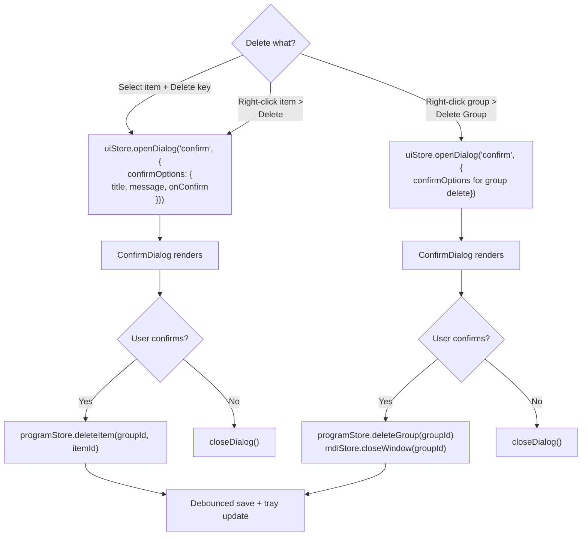
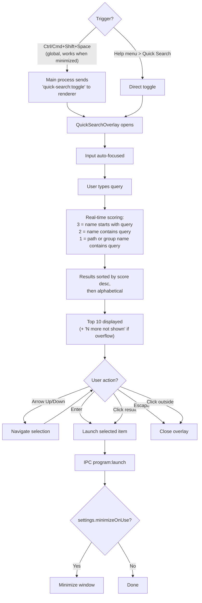
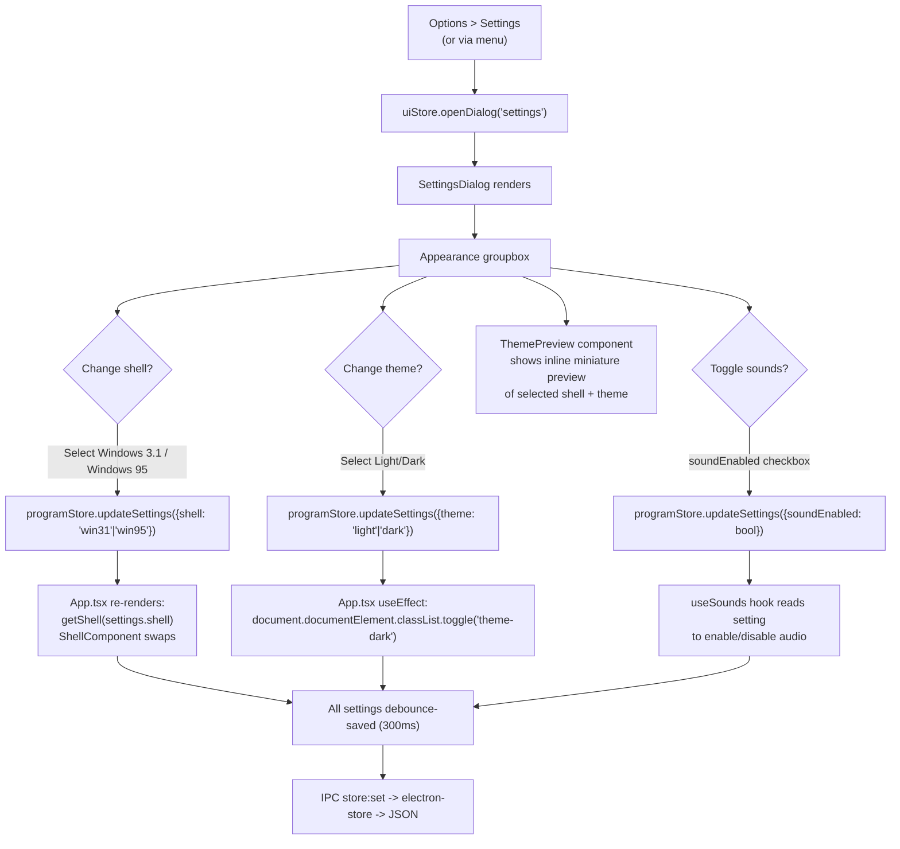
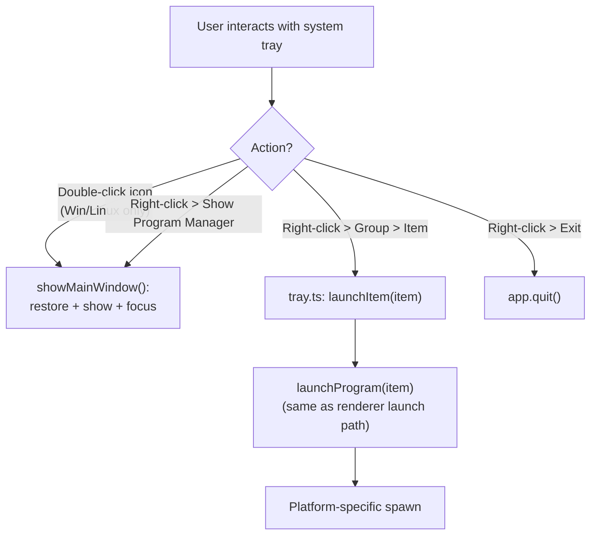
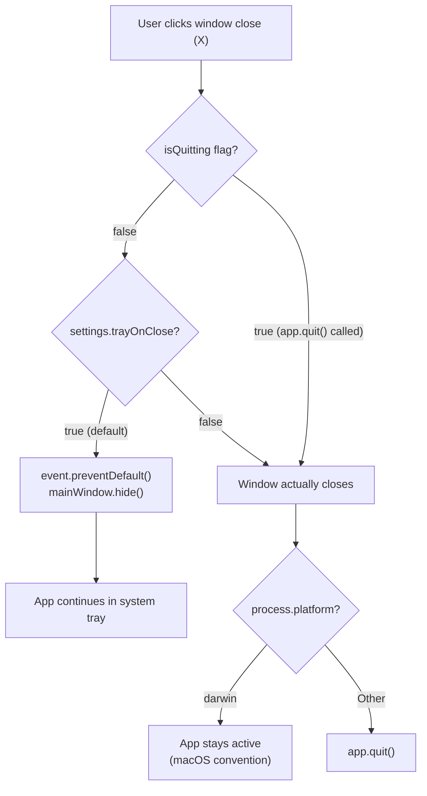

# User Flow Diagrams

Key task flows verified by tracing the actual UI components and store logic.

## First-Run Experience

## Adding a Program Item

## Adding a URL Item

## Organizing Groups

## Renaming and Editing Groups

## Deleting Items and Groups

## Quick Search

## Changing Theme and Shell

## Launching from System Tray

## Window Close Behavior

---

## Research Log

| Source File | What Was Verified |
|---|---|
| `src/main/index.ts` | App startup sequence, single instance lock, global shortcut registration, quit/close lifecycle, activate handler for macOS |
| `src/main/window.ts` | BrowserWindow creation, tray-on-close behavior (event.preventDefault + hide), isQuitting flag, dev vs production URL loading |
| `src/main/tray.ts` | System tray: platform-specific icons, dynamic menu from groups, double-click handler (Win/Linux), direct program launch from tray submenu |
| `src/renderer/src/App.tsx` | First-run detection via localStorage('hasLaunched'), welcome dialog trigger, loadData + startup chime, shell resolution via getShell(), theme CSS class toggle, shared keyboard shortcuts (Enter/Delete), quick search IPC listener |
| `src/renderer/src/store/programStore.ts` | All CRUD actions (addGroup, addItem, updateItem, deleteItem, deleteGroup, moveItem, updateSettings), debounced saves, UUID generation, windowState offset calculation for new groups |
| `src/renderer/src/store/uiStore.ts` | 10 dialog types, openDialog/closeDialog, menu state, quick search state, selection state |
| `src/renderer/src/store/mdiStore.ts` | Window open/close/focus, z-index management, cascade/tile/arrangeIcons via CustomEvent dispatch |
| `src/renderer/src/shells/Win31Shell.tsx` | MenuBar + MDIContainer rendering, Alt+F/O/W/H menu shortcuts, Shift+F4 tile, Shift+F5 cascade, Escape close menu, chrome scale CSS vars, shortcut hint |
| `src/renderer/src/shells/win95/Win95Shell.tsx` | Desktop + Taskbar + StartMenu rendering, start menu toggle, Escape closes start menu, chrome scale CSS vars, shortcut hint |
| `src/renderer/src/components/Dialogs/DialogManager.tsx` | Switch-based dialog rendering for all 10 dialog types |
| `src/renderer/src/components/QuickSearch/QuickSearchOverlay.tsx` | Search scoring (prefix=3, substring=2, path/group=1), max 10 results, keyboard navigation (arrows, Enter, Escape), click handling, auto-focus |
| `src/main/ipc/storeHandlers.ts` | Import/export flows: dialog.showSaveDialog/showOpenDialog, file I/O, 3-stage validation, tray menu update |
| `src/main/ipc/fileHandlers.ts` | Platform-specific executable file filters (Win: exe/bat/cmd/msi/lnk, Mac: app, Linux: desktop/sh) |
| `src/main/ipc/appInfoHandlers.ts` | Auto-populate from file: name extraction, icon extraction via app.getFileIcon/nativeImage, .desktop file parsing, .lnk shortcut resolution |
